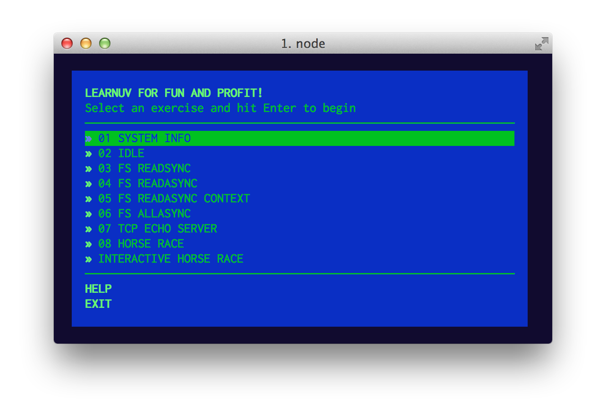

# learnuv

<a href="https://www.patreon.com/bePatron?u=8663953"></a>

Learn uv for fun and profit, a self guided workshop to [the library](https://github.com/libuv/libuv) that powers Node.js.



## Before You Start

Read the [learnuv gitbook](http://thlorenz.github.io/learnuv/book) which explains some libuv and related C language
concepts that will help you complete the exercises.

## Installation

Requires [Python](https://www.python.org/downloads/) 2.6 or 2.7 to be installed.
If python is not in your path set the environment variable `PYTHON` to its
location. For example on Windows: `set PYTHON=C:\Python27\python.exe`

```sh
git clone https://github.com/thlorenz/learnuv && cd learnuv
npm install
```

## Getting Started

```sh
./learnuv help
```

## Building

**learnuv** comes with build commands that you can use instead of the manual steps explained further below.

- **./learnuv ninja**
    Compile your sources with ninja, stored inside `./out/Debug`
- **./learnuv make**
    Compile your sources with make, stored inside `./out/Debug`
- **./learnuv xcode**
    Generate a learnuv Xcode project, named `./learnuv.xcodeproj`

### Windows Caveats

Ninja and Make do not work on windows except via [cygwin](https://www.cygwin.com/).

### Ninja

Highly recommended since it builds faster than any of the other options, so [get ninja](https://ninja-build.org/)
and do:

```sh
./gyp_learnuv.py -f ninja
ninja -C out/Debug
./out/Debug/01_system_info
```

### Make

Works on Linux and OSX.

```sh
./gyp_learnuv.py -f make
make -C out
./out/Debug/01_system_info
```

### Xcode

Works on OSX only. Highly recommended to ease debugging and code navigation.

```sh
./gyp_learnuv.py -f xcode
open learnuv.xcodeproj
```

### Visual Studio

Works on Windows only. **TODO** need to adapt [vcbuild.bat](https://github.com/joyent/libuv/blob/master/vcbuild.bat).

## Running

```
./learnuv
```

## License

MIT
